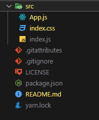

# styled-components

learning styled-components in react

## first step

install styled component

```bash

yarn add styled-component

or

npm i styled component

```

let's cleanup the folder structure.



and change the app.js file.

```jsx
function App() {
  return (
    <div
      style={{
        padding: "2rem",
      }}
    >
      <h1 className="title">Styled components</h1>
      <button className="btn">Click Me</button>
    </div>
  );
}

export default App;
```

let's add some global styles.

```css
body {
  margin: 0;
  font-family: -apple-system, BlinkMacSystemFont, "Segoe UI", "Roboto", "Oxygen",
    "Ubuntu", "Cantarell", "Fira Sans", "Droid Sans", "Helvetica Neue",
    sans-serif;
  -webkit-font-smoothing: antialiased;
  -moz-osx-font-smoothing: grayscale;
}

.title {
  text-align: center;
  text-transform: capitalize;
}

.btn {
  background: #645cff;
  color: #fff;
  border: none;
  border-radius: 0.25rem;
  cursor: pointer;
  text-transform: capitalize;
  padding: 0.25rem;
  display: block;
  width: 200px;
  margin: 1rem auto;
}


```
output


