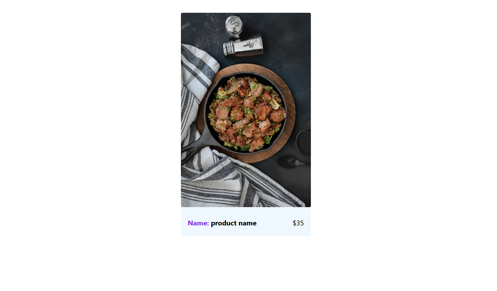

- [styled-components](#styled-components)
  - [first step](#first-step)
    - [install styled component](#install-styled-component)
  - [how to use styled component](#how-to-use-styled-component)
    - [snippets](#snippets)
  - [passing props](#passing-props)
    - [extending css](#extending-css)
    - [extending React component](#extending-react-component)
    - [complex components](#complex-components)
    - [CSS Variables](#css-variables)
    - [Utils Approach](#utils-approach)
    - [Custom Border Example](#custom-border-example)
    - [Card - Setup / Style Container/ Nesting](#card---setup--style-container-nesting)
    - [Global Styles](#global-styles)
    - [Theming](#theming)
    - [Animations](#animations)
    - ['AS' Prop](#as-prop)
    - [CSS Helper Function](#css-helper-function)
    - [Form Setup / ATTRS - Input Example / Submit Button Styles / ATTRS - Button Example](#form-setup--attrs---input-example--submit-button-styles--attrs---button-example)
    - [More Complex Props - List Example](#more-complex-props---list-example)
    - [More Complex Props - Products Example](#more-complex-props---products-example)

# styled-components

learning styled-components in react

## first step

### install styled component

```bash

yarn add styled-component

or

npm i styled component

```

let's cleanup the folder structure.


and change the app.js file.

```jsx
function App() {
  return (
    <div
      style={{
        padding: "2rem",
      }}
    >
      <h1 className="title">Styled components</h1>
      <button className="btn">Click Me</button>
    </div>
  );
}

export default App;
```

let's add some global styles.

```css
body {
  margin: 0;
  font-family: -apple-system, BlinkMacSystemFont, "Segoe UI", "Roboto",
    "Oxygen", "Ubuntu", "Cantarell", "Fira Sans", "Droid Sans",
    "Helvetica Neue", sans-serif;
  -webkit-font-smoothing: antialiased;
  -moz-osx-font-smoothing: grayscale;
}

.title {
  text-align: center;
  text-transform: capitalize;
}

.btn {
  background: #645cff;
  color: #fff;
  border: none;
  border-radius: 0.25rem;
  cursor: pointer;
  text-transform: capitalize;
  padding: 0.25rem;
  display: block;
  width: 200px;
  margin: 1rem auto;
}
```

output


to reuse a in-line style
we have to copy paste the styles to a component

```jsx
function App() {
  return (
    <div
      style={{
        padding: "2rem",
      }}
    >
      <h1 className="title">Styled components</h1>
      <button className="btn">Click Me</button>
      <div>
        <h2
          style={{
            padding: "2rem",
          }}
        >
          hello world
        </h2>
      </div>
    </div>
  );
}

export default App;
```

what if you want to use global css
problem is with that is we cant use the "title" class name to style different element

```jsx
function App() {
  return (
    <div
      style={{
        padding: "2rem",
      }}
    >
      <h1 className="title">Styled components</h1>
      <button className="btn">Click Me</button>
      <div>
        <h2 className="title">hello world</h2>
      </div>
    </div>
  );
}

export default App;
```

example

```css
.title {
  text-align: center;
  text-transform: capitalize;
}

.title {
  color: red;
}
```

output


to solve the problem we have to come up with different class names.
it can get very complicated and harder to track in a large project.

## how to use styled component

### snippets

imports


creation

props and misc


let's add the first component to the application.

```jsx
import styled from "styled-components";

const BasicStyles = styled.h1`
  text-align: center;
  text-transform: capitalize;
`;

function App() {
  return (
    <div
      style={{
        padding: "2rem",
      }}
    >
      <BasicStyles>Styled components</BasicStyles>
      <button className="btn">Click Me</button>
      <div>
        <h2 className="title">hello world</h2>
      </div>
    </div>
  );
}

export default App;
```

by doing so we eliminate both issues we can reuse it any where.
basic styles component can be used in components.

this is a react component we are building.
BasicStyles component is a react component there for we have to use Capital letters for the First letter.

```html
<div style="padding: 2rem;">
  <h1 class="sc-dkPtRN hUtUcw">Styled components</h1>
  <h1 class="sc-dkPtRN hUtUcw">Styled components</h1>
  <h1 class="sc-dkPtRN hUtUcw">Styled components</h1>
  <h1 class="sc-dkPtRN hUtUcw">Styled components</h1>
  <button class="btn">Click Me</button>
  <div><h2 class="title">hello world</h2></div>
</div>
```

as you can see styled component provides a unique class names for the elements.

let's create a default button styled components.

```jsx

const DefaultButton = styled.button`
  background: #645cff;
  color: #fff;
  border: none;
  border-radius: 0.25rem;
  cursor: pointer;
  text-transform: capitalize;
  padding: 0.25rem;
  display: block;
  width: 200px;
  margin: 1rem auto;
`;


```

and use it

```jsx
function App() {
  return (
    <div
      style={{
        padding: "2rem",
      }}
    >
      <BasicStyles>Styled components</BasicStyles>
      <DefaultButton>click me</DefaultButton>
    </div>
  );
}

export default App;
```
as we can see out js file gets bigger as we add more components 

solution is to create a separate component folder.


## passing props

because this is a react component we can pass props to it.

but accessing it inside the styled component is bit different.

these are the different ways we can pass props.
```jsx
import styled from "styled-components";

export const BasicStyles = styled.h1`
  text-align: center;
  text-transform: capitalize;
  /* color: ${(props) => props.special && "red"}; */
  /* color: ${({ special }) => special && "red"}; */
  color: ${({ special }) => (special ? "red" : "black")};
`;

```
### extending css

```jsx
import styled from "styled-components";
export const DefaultButton = styled.button`
  background: #645cff;
  color: #fff;
  border: none;
  border-radius: 0.25rem;
  cursor: pointer;
  text-transform: capitalize;
  padding: 0.25rem;
  display: block;
  width: 200px;
  margin: 1rem auto;
`;

//  overriding default button styles

export const HipsterButton = styled(DefaultButton)`
  width: 400px;
  background-color: transparent;
  color: #645cff;
  border: 1px solid #645cff;
`;

```
let's use it.

```jsx

function App() {
  return (
    <div
      style={{
        padding: "2rem",
      }}
    >
      <BasicStyles special>Styled components</BasicStyles>
      <BasicStyles>Styled components</BasicStyles>
      <DefaultButton>click me</DefaultButton>
      <HipsterButton>click me</HipsterButton>
    </div>
  );
}

```
output


### extending React component

```jsx
import styled from "styled-components";
import Button from "@mui/material/Button";

// extending a react component

export const StyledButtonMUI = styled(Button)`
  text-transform: lowercase;
`;


```
```jsx
      <Button variant="contained">Default MUI button</Button>
      <br />
      <br />
      <StyledButtonMUI variant="contained">
        extended styled button
      </StyledButtonMUI>
```


### complex components

complex component

```jsx
import React from "react";
import styled from "styled-components";
const ComplexTitle = ({ title }) => {
  return (
    <Wrapper>
      <h1>{title}</h1>
      <div className="underline"></div>
    </Wrapper>
  );
};

const Wrapper = styled.div`
  h1 {
    text-transform: uppercase;
    text-align: center;
  }

  .underline {
    width: 5rem;
    height: 0.25rem;
    background-color: #645cff;
    margin: 0 auto;
  }
`;

export default ComplexTitle;

```

use it in home component

```jsx
import ComplexTitle from "./components/complex-title/complex-title";

function App() {
  return (
    <div
      style={{
        padding: "2rem",
      }}
    >
      <ComplexTitle title={"more complex title"} />
    </div>
  );
}

export default App;

```


here we can use simple class names because these class names are only applied to this specific component.

let's explore it more.

let's create a random component.

```jsx
import React from "react";
import styled from "styled-components";
const Random = () => {
  return (
    <Wrapper>
      <div className="underline"></div>
    </Wrapper>
  );
};

const Wrapper = styled.div`
  .underline {
    width: 5rem;
    height: 0.25rem;
    background-color: rgb(255, 184, 92);
    margin: 4rem auto;
  }
`;

export default Random;


```
here we are using the underline class name again but it is not overriding the above component.


sll the styles in your global css files can be applied as normal with styled component.
but you can override those classes in you styled component.

### CSS Variables
let's go to our ```index.css``` file and 
```css
:root {
  --primary: #645cff;
}
```

then use it in our ```complex component```

```jsx
import React from "react";
import styled from "styled-components";
const ComplexTitle = ({ title }) => {
  return (
    <Wrapper>
      <h1>{title}</h1>
      <div className="underline"></div>
    </Wrapper>
  );
};

const Wrapper = styled.div`
  h1 {
    text-transform: uppercase;
    text-align: center;
  }

  .underline {
    width: 5rem;
    height: 0.25rem;
    background-color: var(--primary);
    margin: 0 auto;
  }
`;

export default ComplexTitle;


```


### Utils Approach

instead of using global css we can use ```js file``` to store variables.

let's create a ``` utils.js ``` file

```js
export const colors = {
    primary:"#645cff"
}

```


```jsx

import React from "react";
import styled from "styled-components";
import { colors } from "../../utils";
const AlternativeTitle = ({ title }) => {
  return (
    <Wrapper>
      <h1>{title}</h1>
      <div className="underline"></div>
    </Wrapper>
  );
};

const Wrapper = styled.div`
  h1 {
    text-transform: uppercase;
    text-align: center;
  }

  .underline {
    width: 5rem;
    height: 0.25rem;
    background-color: ${colors.primary};
    margin: 0 auto;
  }
`;

export default AlternativeTitle;


```
output


###  Custom Border Example 
with global css we only have to import once.
with js file we have to import it every place where we need it.
with these two options css variables are better.

using a util use case.
this is a custom function to set a border.
```jsx
export const setBorder = ({width,type,color})=>{
    return `${width}px ${type} ${color}`
}
```
let's use it.
```jsx

import React from "react";
import styled from "styled-components";
import { colors,setBorder } from "../../utils";
const AlternativeTitle = ({ title }) => {
  return (
    <Wrapper>
      <h1>{title}</h1>
      <div className="underline"></div>
      <div className="box"></div>
    </Wrapper>
  );
};

const Wrapper = styled.div`
  h1 {
    text-transform: uppercase;
    text-align: center;
  }

  .underline {
    width: 5rem;
    height: 0.25rem;
    background-color: ${colors.primary};
    margin: 0 auto;
  }
  .box {
    border: ${setBorder({color:'red',type:"solid",width:"1"})};
    height: 1rem;
  }
`;

export default AlternativeTitle;


```

as you can see we can customize the border on the fly.
let's look at a normal css variable.

```jsx
:root {
  --primary: #645cff;
  --border:1px solid red;
}

```

```jsx

const Wrapper = styled.div`
  h1 {
    text-transform: uppercase;
    text-align: center;
  }

  .underline {
    width: 5rem;
    height: 0.25rem;
    background-color: var(--primary);
    margin: 0 auto;
  }

  .box {
    border: var(--border);
    height: 1rem;
  }
`;


```
here we can use the same styles but we can't customize it.
so these is a example of using js files over global css.


###  Card - Setup / Style Container/ Nesting

let's create a card component to understand scss features in styled components.
```jsx
import React from "react";
import styled from "styled-components";

const Card = () => {
  return (
    <Wrapper>
      
      <footer>
        <h4>product name</h4>
        <p>$35</p>
      </footer>
    </Wrapper>
  );
};

const Wrapper = styled.article`
  width: clamp(100px, 300px, 400px);
  background-color: aliceblue;
  border-radius: 3px;
  margin: 0 auto;
  overflow: hidden;
  transition: all 0.3s ease-in-out;
  img {
    width: 100%;
    border-radius: 3px;
    transition: all 0.6s ease-in-out;
  }
  footer {
    display: flex;
    justify-content: space-between;
    padding: 0 1rem;
    align-items: center;

    h4 {
      font-weight: 700;
      &::before {
        content: "Name: ";
        color: blueviolet;
      }
    }
  }

  &:hover {
    box-shadow: 5px 3px 43px #9e9c9c3b;
    cursor: pointer;
  }

  &:hover img {
    transform: scale(1.01);
  }
`;

export default Card;


```



###  Global Styles

let's add global css to the application


let's create a **global-styles.jsc** file.

```jsx
import { createGlobalStyle } from "styled-components";

const GlobalStyles = createGlobalStyle`

:root {
  --primary: #645cff;
  --border:1px solid red;
}
body {
  margin: 0;
  font-family: -apple-system, BlinkMacSystemFont, "Segoe UI", "Roboto", "Oxygen",
    "Ubuntu", "Cantarell", "Fira Sans", "Droid Sans", "Helvetica Neue",
    sans-serif;
  -webkit-font-smoothing: antialiased;
  -moz-osx-font-smoothing: grayscale;
}

`;

export default GlobalStyles;


```
and use it in  **app.js**
```jsx
import Card from "./components/card/card";
import GlobalStyles from "./global-styles";

function App() {
  return (
    <div
      style={{
        padding: "2rem",
      }}
    >
      <GlobalStyles />
      <Card />
    </div>
  );
}

export default App;

```

###  Theming
let's create a **theme.js** file.
```jsx
export const BaseTheme = {
  color: "#222",
  background: "#fff",
};

export const DarkTheme = {
  color: "#fff",
  background: "#222",
};


```
and use it inside the **app.js**

```jsx
import GlobalStyles from "./global-styles";
import styled, { ThemeProvider } from "styled-components";
import { useState } from "react";
import { BaseTheme, DarkTheme } from "./theme";

const Container = styled.div`
  padding: 1rem;
  color: ${(props) => props.theme.color};
  background-color: ${(props) => props.theme.background};
`;
function App() {
  const [themeDarkMode, setThemeDarkMode] = useState(false);
  return (
    <ThemeProvider theme={themeDarkMode === true ? DarkTheme : BaseTheme}>
      <GlobalStyles />
      <Container>
        <h1>Hello World</h1>
        <button
          onClick={() => {
            setThemeDarkMode(!themeDarkMode);
          }}
          className="btn"
        >
          {themeDarkMode ? "enable Light Mode" : "enable Dark Mode"}
        </button>
      </Container>
    </ThemeProvider>
  );
}

export default App;

```
light mode

dark mode

```jsx```
###  Animations

let's create a spinner component.
```jsx
import styled, { keyframes } from "styled-components";
import React from "react";

const spinner = keyframes`
to{
    transform: rotate(260deg);
}

`;

const Wrapper = styled.div`
  width: 6rem;
  height: 6rem;
  border: 9px solid paleturquoise;
  border-radius: 50%;
  border-top-color: aquamarine;
  border-top-width: 5px;
  animation: ${spinner} 0.4s linear infinite;
`;

const Loading = () => {
  return <Wrapper></Wrapper>;
};

export default Loading;

```
and use it
```jsx
import Loading from "./components/loarding/loarding";

function App() {
  return (
    <div style={{ padding: "2rem" }}>
      <h2 className="title">Animation Example</h2>
      <Loading />
    </div>
  );
}

export default App;


```
**output**


###  'AS' Prop
let's use as prop

in our hipster component.
```jsx
import styled from "styled-components";
import Button from "@mui/material/Button";

export const DefaultButton = styled.button`
  background: #645cff;
  color: #fff;
  border: none;
  border-radius: 0.25rem;
  cursor: pointer;
  text-transform: capitalize;
  padding: 0.25rem;
  display: block;
  width: 200px;
  margin: 1rem auto;
`;

//  overriding default button styles

export const HipsterButton = styled(DefaultButton)`
  width: clamp(100px, 150px, 200px);
  background-color: transparent;
  color: #645cff;
  border: 1px solid #645cff;
  padding: 1rem;
  display: inline-block;
  margin-left: 1rem;
  text-decoration: none;import { HipsterButton } from "./components/default-button/default-button";
import GlobalStyles from "./global-styles";

function App() {
  return (
    <div style={{ padding: "2rem" }}>
      <GlobalStyles />
      <HipsterButton>Click me</HipsterButton>
      <HipsterButton>Click me</HipsterButton>
      <HipsterButton as="a" href="https://www.google.com">
        Click me
      </HipsterButton>
      <HipsterButton>Click me</HipsterButton>
    </div>
  );
}

export default App;

  font-size: 1rem;
  text-align: center;
`;

// extending a react component

export const StyledButtonMUI = styled(Button)`
  text-transform: lowercase;
`;

```
use it inside the **app.js**

```jsx
import { HipsterButton } from "./components/default-button/default-button";
import GlobalStyles from "./global-styles";

function App() {
  return (
    <div style={{ padding: "2rem" }}>
      <GlobalStyles />
      <HipsterButton>Click me</HipsterButton>
      <HipsterButton>Click me</HipsterButton>
      <HipsterButton as="a" href="https://www.google.com">
       i am a link
      </HipsterButton>
      <HipsterButton>Click me</HipsterButton>
    </div>
  );
}

export default App;


```


###  CSS Helper Function
let's create a large button.
```jsx
import styled, { css } from "styled-components";
import Button from "@mui/material/Button";

export const DefaultButton = styled.button`
  background: #645cff;
  color: #fff;
  border: none;
  border-radius: 0.25rem;
  cursor: pointer;
  text-transform: capitalize;
  ${(props) =>
    props.large
      ? css`
          padding: 1rem;
          font-size: 1.5rem;
          font-weight: 700;
        `
      : css`
          padding: 0.5rem;
          font-size: 1rem;
          font-weight: 500;
        `}
  display: block;
  width: 200px;
  margin: 1rem auto;
`;

//  overriding default button styles

export const HipsterButton = styled(DefaultButton)`
  width: clamp(100px, 150px, 200px);
  background-color: transparent;
  color: #645cff;
  border: 1px solid #645cff;
  padding: 1rem;
  display: inline-block;
  margin-left: 1rem;
  text-decoration: none;
  font-size: 1rem;
  text-align: center;
`;

// extending a react component

export const StyledButtonMUI = styled(Button)`
  text-transform: lowercase;
`;

```
and parse the large prop from **app.js**
```jsx
import {
  DefaultButton,
  HipsterButton,
} from "./components/default-button/default-button";
import GlobalStyles from "./global-styles";
import styled from "styled-components/macro";

function App() {
  return (
    <div style={{ padding: "2rem" }}>
      <GlobalStyles />
      <DefaultButton>Click Me</DefaultButton>
      <DefaultButton large>Large Button</DefaultButton>
    </div>
  );
}

export default App;

```

output


###  Form Setup / ATTRS - Input Example / Submit Button Styles / ATTRS - Button Example
let's create a form component.
here we are using attr function to pass attribute.

```jsx

import styled, { css } from "styled-components";
import React from "react";
import { DefaultButton } from "../default-button/default-button";

const Form = () => {
  return (
    <Wrapper>
      <h2>some random stuff</h2>
      <Button>click me</Button>
      <form>
        <h2>Form</h2>
        <Input type="text" />
        <Input type="email" placeholder={"email"} />
        <Input type="password" />
        <Input type="text" />
        <Button type={"submit"}>submit here</Button>
      </form>
    </Wrapper>
  );
};

const Wrapper = styled.div`
  form {
    width: 300px;
    background-color: #bebebe29;
    padding: 2rem;
    margin-top: 1rem;
  }
`;

const Button = styled.button.attrs((props) => {
  return {
    type: props.type || "button",
  };
})`
  background-color: var(--primary);
  border: none;
  padding: 0.25rem;
  color: #fff;
  cursor: pointer;
  ${({ type }) => {
    return (
      type === "submit" &&
      css`
        display: block;
        width: 100%;
        margin-top: 1rem;
        border-radius: 0.25rem;
      `
    );
  }}
`;

const Input = styled.input.attrs((props) => {
  return {
    type: props.type || "text",
    placeholder: props.placeholder || "enter a value here",
  };
})`
  box-sizing: border-box;
  width: 100%;
  padding: 0.25rem;
  border: 2px solid #d9dce0;
  margin-top: 1rem;
`;
export default Form;

```


###  More Complex Props - List Example

```jsx
import styled, { css } from "styled-components";
import React from "react";

const fruits = ["apples", "banana", "orange", "peach"];

const Item = styled.li`
  list-style-type: none;
  ${(props) => {
    if (props.odd) {
      return css`
        color: red;
        background-color: antiquewhite;
      `;
    } else {
      return css`
        color: blue;
        background-color: aquamarine;
      `;
    }
  }}
`;

const List = () => {
  return (
    <ul>
      {fruits.map((item, index) => (
        <Item odd={(index + 1) % 2 !== 0} key={index}>
          {item}
        </Item>
      ))}
    </ul>
  );
};

export default List;


```
;

```jsx
import styled, { css } from "styled-components";
import React from "react";

const fruits = ["apples", "banana", "orange", "peach"];

const Item = styled.li`
  list-style-type: none;
  ${(props) => {
    if (props.odd) {
      return css`
        color: red;
        background-color: antiquewhite;
      `;
    } else {
      return css`
        color: blue;
        background-color: aquamarine;
      `;
    }
  }}
`;

const List = () => {
  return (
    <ul>
      {fruits.map((item, index) => (
        <Item odd={(index + 1) % 2 !== 0} key={index}>
          {item}
        </Item>
      ))}
    </ul>
  );
};

export default List;


```
###  More Complex Props - Products Example

here we are using if condition to change the font color dynamically.

```jsx
import styled, { css } from "styled-components";
import ComplexTopic from "../complex-title/complex-title";

import React from "react";
const products = [
  {
    id: 1,
    name: "chair",
    price: 30,
  },
  {
    id: 2,
    name: "bed",
    price: 150,
  },
  {
    id: 3,
    name: "couch",
    price: 500,
  },
];

const Products = () => {
  return (
    <div>
      <ComplexTopic title={"all products"} />
      <ul>
        {products.map(({ price, name, id }) => {
          return (
            <Card price={price} key={id}>
              <p className="name">{name}</p>
              <p className="price">${price}</p>
            </Card>
          );
        })}
      </ul>
    </div>
  );
};

const Card = styled.li`
  width: 200px;
  display: flex;
  justify-content: space-between;
  padding: 0% 0.5rem;
  padding-top: 1rem;
  align-items: center;
  border: 1px solid #f1e57e60;
  list-style-type: none;
  background-color: #d1d0c413;
  margin: 1rem 2rem;
  box-shadow: 0rem 0.1rem 0.1rem blanchedalmond;

  .name {
    font-weight: 600;
  }
  .price {
    font-weight: 600;
    ${({ price }) => {
      if (price < 100) {
        return css`
          color: green;
        `;
      } else if (price >= 100 && price <= 200) {
        return css`
          color: #38c5d8;
        `;
      } else {
        return css`
          color: red;
        `;
      }
    }}
  }
`;

export default Products;


```


